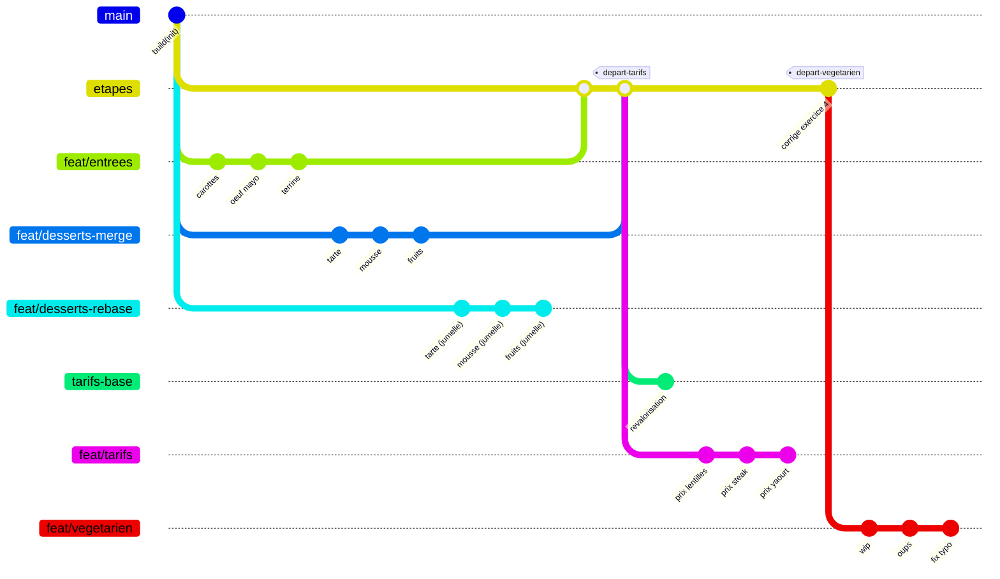
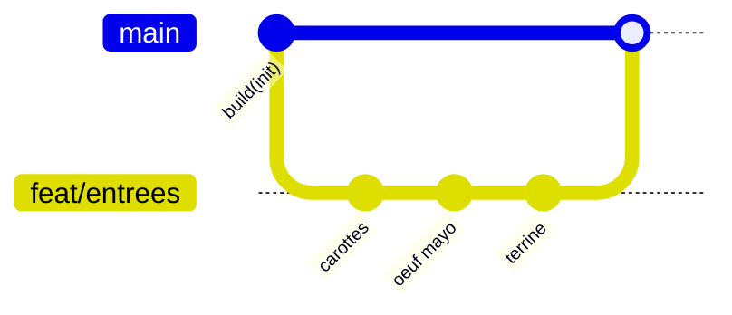
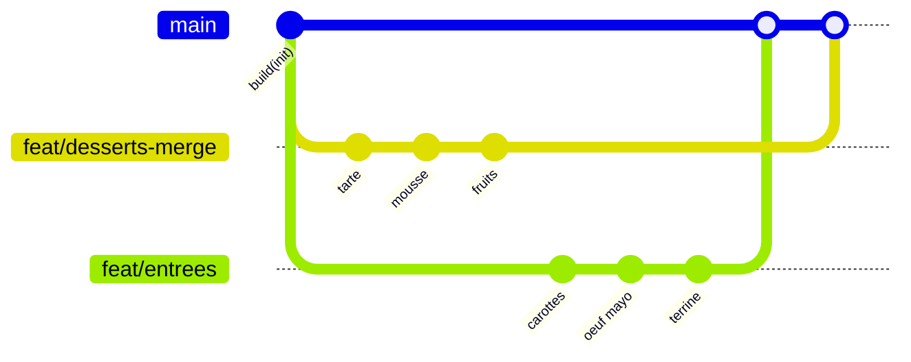
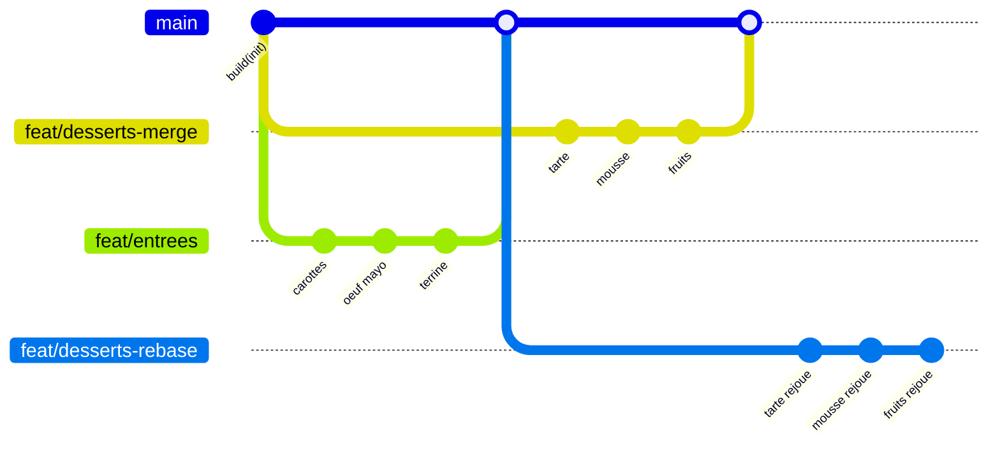
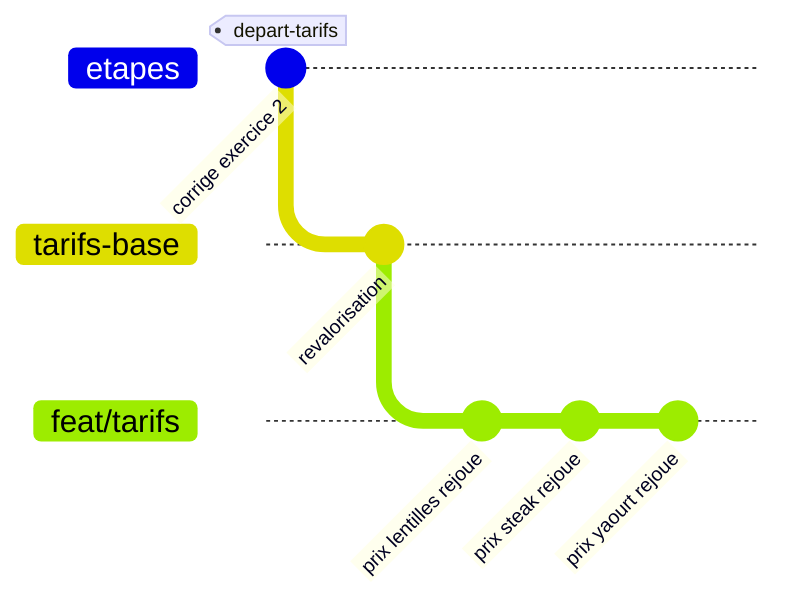
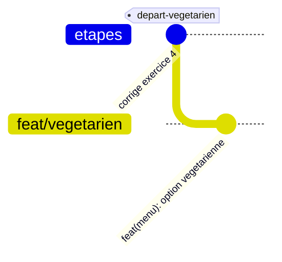

# TP Git — Le menu du resto U

Ce dépôt est le support d'un TP Git de trois heures. Vous y trouverez un petit
programme Java qui décrit le menu d'un restaurant universitaire, et un
historique déjà construit dont vous allez assembler les branches.

## La commande à retenir

```
java Verificateur.java
```

Lancez-la depuis la **racine du dépôt**, à chaque fois que vous voulez savoir où
vous en êtes. Elle affiche un état des lieux et vous dit quel exercice est
atteint. Pour le détail d'un exercice précis :

```
java Verificateur.java 2
```

Aucune compilation n'est nécessaire : Java exécute le fichier directement.

## Prérequis

Un **JDK 17 ou supérieur**, et rien d'autre. Pas de Maven, pas de Gradle,
aucune dépendance à installer.

Pour vérifier votre installation et votre configuration Git :

```
bash outils/etat.sh
```

## Comment récupérer le dépôt

**Faites un fork**, pas un dépôt à partir d'un modèle.

Au moment de créer le fork, GitHub ne copie par défaut que la branche
principale. **Décochez « Copy the default branch only »** pour obtenir les sept
branches d'exercice. Sans elles, aucune commande du TP ne fonctionne.

Clonez ensuite votre fork :

```
git clone <adresse de votre fork>
cd tp-git-menu
```

Les commandes du sujet désignent les branches d'exercice sous la forme
`origin/feat/entrees` : vous n'avez aucune branche à créer après le clone.

## Le sujet

Ce TP se déroule en cinq exercices. Chacun part d'un état précis de
l'historique et vous demande de le faire évoluer. Après chaque exercice, le
vérificateur vous dit ce qui ne va pas.

Vous consignerez vos réponses dans un fichier `RAPPORT.md` que vous créerez à
la racine du dépôt.

Les commandes utiles sont regroupées dans [docs/commandes.md](docs/commandes.md)
et les concepts Git (zones, fast-forward, branches distantes...) dans
[docs/concepts.md](docs/concepts.md) — à imprimer si vous le souhaitez.

---

### Exercice 0 — Prise en main


#### L'arbre que vous avez sous les yeux



#### Contexte

Le dépôt contient un menu de trois plats, une affiche qui l'annonce, et sept
branches d'exercice déjà construites. C'est le seul exercice où vous ne
produisez rien.

#### Ce que vous faites

Forkez le dépôt en **décochant « Copy the default branch only »**, puis clonez
votre fork. Placez-vous à la racine et lancez :

```
java Verificateur.java
```

Lisez l'état des lieux. Puis regardez l'historique :

```
git log --graph --oneline --all
```

Enfin, vérifiez votre environnement et appliquez les corrections indiquées :

```
bash outils/etat.sh
```

Parmi elles, celle-ci concerne ce dépôt et lui seul :

```
git config merge.ff false
```

Ce dépôt est réglé pour que chaque fusion laisse une trace visible dans
l'historique, comme le font beaucoup d'équipes.

#### Comment lire le vérificateur

Le programme affiche une ligne par contrôle. Une ligne en échec se lit ainsi :

```
  ECHEC  total du menu                    1240 (attendu 1335)
```

De gauche à droite : le résultat du contrôle, son intitulé, la valeur qu'il a
trouvée dans vos fichiers, et entre parenthèses celle qu'il attendait. Votre
travail consiste à faire disparaître les lignes `ECHEC`.

Relancez-le **après chaque fusion et après chaque résolution de conflit**.
C'est votre seul retour.

#### Ce que vous observez

Dans le graphe, les branches d'exercice portent le préfixe `origin/` :
`origin/feat/entrees` désigne la branche telle qu'elle existe sur le dépôt
distant. C'est sous cette forme que les exercices suivants y feront référence.
Vous n'avez aucune branche à créer.

#### Dans votre rapport

Le nombre de plats et le total annoncés par le vérificateur.

---

### Exercice 1 — Trois commits et une fusion


#### L'arbre visé



#### Contexte

La branche `origin/feat/entrees` ajoute trois entrées au menu, un plat par
commit. Ces commits sont déjà faits : vous allez les lire, puis les intégrer à
`main`.

#### Ce que vous faites

Lisez d'abord les trois commits, sans vous déplacer :

```
git log origin/feat/entrees
```

Placez-vous sur `main` et fusionnez :

```
git switch main
git merge origin/feat/entrees
```

Lancez le vérificateur. Puis notez le SHA du commit de fusion que vous venez
d'obtenir : vous en aurez besoin à l'exercice 3.

```
git log --oneline -1
```

Les sept premiers caractères affichés sont le SHA de votre commit de fusion.
Copiez-les quelque part : c'est ainsi que vous vous y référerez, et il sera
différent du SHA d'un camarade — c'est normal, chaque commit de fusion est
unique (voir [docs/concepts.md](docs/concepts.md)).

```
java Verificateur.java 1
```

#### Ce que vous observez

```
git log --graph --oneline --all
```

Un **commit de fusion** est apparu au bout de `main`, et le graphe montre une
branche qui part et qui revient. C'est la forme que doit avoir toute fusion de
ce TP.

#### Dans votre rapport

Le graphe, le message du commit de fusion, et son SHA.

> **Point de synchronisation.** Ne passez à l'exercice 2 qu'une fois
> `java Verificateur.java 1` entièrement vert.

---

### Exercice 2 — Une fusion qui entre en conflit


#### L'arbre visé



#### Contexte

La branche `origin/feat/desserts-merge` ajoute trois desserts. Elle est partie
du commit initial, en même temps que les entrées : les deux branches ont
modifié les mêmes fichiers sans se voir.

#### Ce que vous faites

Depuis `main` :

```
git merge origin/feat/desserts-merge
```

Git s'arrête et signale deux fichiers en conflit. Pour lire les marqueurs de
conflit et savoir comment les résoudre, voir
[docs/concepts.md](docs/concepts.md).

#### Les trois choses à traiter

**1. `CHANGELOG.md` — gardez les deux côtés.** Les trois lignes des entrées
s'opposent aux trois lignes des desserts, sous la même rubrique. Les six
modifications ont bien eu lieu : la résolution consiste à garder les six lignes.

**2. `AFFICHE.md`, ligne du total — aucun des deux côtés n'est la réponse.** Un
côté annonce 880, l'autre 890. Ni l'un ni l'autre n'est correct : le menu réunit
maintenant les entrées **et** les desserts. Si votre éditeur vous propose
« accepter le courant » ou « accepter l'entrant », les deux vous donneront un
résultat faux. Calculez la bonne valeur.

**3. `AFFICHE.md`, ligne du nombre de plats — Git n'a rien signalé, et la
valeur est fausse.** Les deux branches avaient écrit 6 ; comme elles écrivaient
la même chose, Git a pris cette valeur sans rien dire. Or le menu compte
désormais 9 plats. Corrigez-la vous-même.

C'est le point le plus important de la journée : **une fusion sans conflit ne
garantit rien.** Git sait recoller des lignes, il ne sait pas si le résultat a
du sens. C'est le vérificateur qui vous le révèle, et c'est pour cela qu'il faut
le lancer après chaque fusion.

Remarquez au passage que `Menu.java` s'est fusionné tout seul, et correctement :
les entrées se sont insérées en haut du tableau, les desserts en bas.

#### Terminer la fusion

Une fois les deux fichiers résolus :

```
git add AFFICHE.md CHANGELOG.md
git commit
java Verificateur.java 2
```

#### Dans votre rapport

Les deux blocs de conflit tels que Git vous les a présentés, et la valeur que
vous avez retenue pour le total. Si vous collez un bloc de conflit dans
`RAPPORT.md`, **décalez ses lignes de deux espaces** : sinon le vérificateur les
prendra pour un conflit non résolu.

---

### Exercice 3 — Le même scénario, en rebase


#### L'arbre visé



#### Contexte

`origin/feat/desserts-rebase` est la jumelle exacte de la branche de
l'exercice 2 : mêmes fichiers, mêmes messages, seuls les identifiants de commit
diffèrent. Vous allez obtenir le même résultat par un autre chemin, pour
comparer les deux historiques.

**Aucune fusion dans cet exercice.**

#### Ce que vous faites

```
git switch feat/desserts-rebase
git rebase <SHA du commit de fusion noté à l'exercice 1>
```

Remplacez `<SHA du commit de fusion noté à l'exercice 1>` par le SHA que vous
avez copié : `git rebase 3f9a2c1` par exemple, avec votre propre valeur.

> Si vous êtes perdu à n'importe quel moment :
>
> ```
> git rebase --abort
> ```
>
> Vous revenez exactement où vous étiez avant de lancer le rebase, et vous
> pouvez recommencer.

Le rebase ne fusionne pas : il **rejoue** vos commits un par un par-dessus le
commit que désigne ce SHA. Il s'arrête donc à chaque commit qui pose problème,
et il s'arrêtera **deux fois** :

- **au premier commit rejoué**, sur `CHANGELOG.md` : gardez les trois lignes des
  entrées et celle de la tarte ;
- **au troisième**, sur `AFFICHE.md` : même situation qu'à l'exercice 2, la
  bonne valeur du total n'est aucune des deux proposées. Et **le nombre de
  plats est là encore faux sans que Git l'ait signalé** : corrigez-le aussi.

Le deuxième commit se rejoue tout seul.

À chaque arrêt, après avoir corrigé les fichiers :

```
git add .
git rebase --continue
```

Puis, une fois le rebase terminé :

```
java Verificateur.java 3
```

#### Ce que vous observez

```
git log --graph --oneline main feat/desserts-rebase
```

Un seul graphe, deux formes. À gauche `main`, avec sa fourche et son commit de
fusion. À droite la jumelle rebasée : trois commits en ligne droite posés sur
le même SHA de départ, sans commit de fusion. Même point de départ, même
contenu final, deux historiques différents.

Regardez aussi les identifiants des trois commits rejoués, et comparez-les à
ceux de `origin/feat/desserts-rebase`.

#### Dans votre rapport

Collez la sortie de la commande ci-dessus. Ajoutez une phrase sur ce qui a
changé entre les deux formes, et une autre sur ce que sont devenus les
identifiants de commit.

> **Point de synchronisation.** Ne passez à l'exercice 4 qu'une fois
> `java Verificateur.java 3` entièrement vert.

---

### Exercice 4 — Un conflit à chaque commit rejoué


#### L'arbre visé



#### Contexte

À partir d'ici, on quitte `main` : les deux derniers exercices se déroulent sur
une base commune qui contient déjà la correction de l'exercice précédent. Si
vous avez buté sur un exercice, vous repartez malgré tout du bon pied.

Une autre équipe a déjà poussé la revalorisation annuelle des tarifs sur
`origin/tarifs-base`. Votre branche `feat/tarifs` ajuste les mêmes prix, mais
différemment. Vous ne fusionnez pas : vous passez par-dessus leur travail.

#### Ce que vous faites

```
git switch feat/tarifs
git rebase origin/tarifs-base
```

> ```
> git rebase --abort
> ```
>
> Toujours disponible. Profitez de cet exercice pour l'essayer au moins une
> fois : abandonnez volontairement le rebase au premier conflit, vérifiez avec
> `git log --oneline` que votre branche est intacte, puis relancez le rebase.

**Ne lancez pas le vérificateur avant d'avoir terminé ce rebase.** La branche
`feat/tarifs` est volontairement incohérente tant que l'arbitrage n'est pas
fait : son affiche annonce déjà le total d'arrivée, que son menu n'atteindra
qu'à la fin.

#### Les trois arrêts

Le rebase s'arrête **trois fois, une par commit rejoué**, toujours sur
`Menu.java`. À chaque fois, un prix de la revalorisation s'oppose au vôtre.

Les prix attendus à l'arrivée sont imposés :

| Plat | Prix attendu | D'où il vient |
|---|---|---|
| Salade de lentilles | 140 | le côté `origin/tarifs-base` |
| Steak haché frites | 390 | le côté de votre branche |
| Yaourt nature | 95 | le côté `origin/tarifs-base` |

Autrement dit : **prendre systématiquement le même côté échoue.** Vous devez
lire chaque conflit et composer.

Attention également : un bloc de conflit peut contenir plus d'une ligne. Le
steak et le yaourt se suivent dans le tableau, Git les présente donc ensemble,
et une seule des deux lignes est réellement en jeu. Recopiez l'autre telle
qu'elle doit être.

À chaque arrêt :

```
git add Menu.java
git rebase --continue
```

Puis, à la fin :

```
java Verificateur.java 4
```

#### Ce que vous observez

```
git log --graph --oneline origin/tarifs-base feat/tarifs
```

Vos trois commits sont maintenant posés au-dessus de la revalorisation, en
ligne droite. Aucun commit de fusion.

#### Dans votre rapport

Pour chacun des trois conflits, la ligne que vous avez retenue et la raison.

---

### Exercice 5 — Réécrire ses commits avant de les montrer


#### L'arbre visé



#### Contexte

La branche `origin/feat/vegetarien` ajoute une option végétarienne au plat
principal. Le travail est correct, mais il a été fait en trois commits aux
messages inutilisables : `wip`, `oups`, `fix typo`. Vous allez les réunir en un
seul, correctement nommé.

#### Avant de commencer

Cet exercice ouvre un éditeur de texte. Vérifiez que Git sait lequel ouvrir :

```
git config --get core.editor
```

Si la commande ne renvoie rien, définissez-le maintenant, sans quoi Git ouvrira
Vim et vous aurez du mal à en sortir :

```
git config --global core.editor "code --wait"
```

#### Ce que vous faites

```
git switch feat/vegetarien
git rebase -i HEAD~3
```

Git ouvre la liste des trois commits, chacun précédé de `pick`. Les trois
verbes à utiliser (`pick`, `squash`, `reword`) sont détaillés dans
[docs/commandes.md](docs/commandes.md).

Laissez `pick` sur la première ligne, remplacez `pick` par `squash` sur les
deux suivantes, enregistrez et fermez. Git rouvre alors l'éditeur avec les
trois anciens messages : effacez-les et écrivez à la place :

```
feat(menu): ajoute une option végétarienne au plat principal
```

Enregistrez et fermez. Puis :

```
java Verificateur.java 5
```

> ```
> git rebase --abort
> ```
>
> Vaut aussi pour le rebase interactif.

#### Ce que vous observez

```
git log --oneline origin/feat/vegetarien..feat/vegetarien
git log --oneline origin/etapes..feat/vegetarien
```

La première commande ne renvoie rien de commun : vos commits ne sont plus les
mêmes objets. La seconde en montre un seul, avec le bon message : `origin/etapes`
désigne le commit dont `feat/vegetarien` est partie, avant la réécriture. Les
trois commits d'origine ont été remplacés par un unique commit qui porte le
même contenu.

#### Dans votre rapport

Les messages des trois commits d'origine, le message final, et une phrase sur
ce que cette réécriture aurait posé comme problème si la branche avait déjà été
partagée avec quelqu'un d'autre.

---

## Exercices bonus

À faire seulement si vous avez terminé les cinq exercices. Ils sont
indépendants les uns des autres, aucun n'est évalué, et le vérificateur ne les
connaît pas.

Chacun commence par créer une branche jetable : vous ne risquez donc rien, et
vous pouvez les recommencer autant de fois que vous voulez.

### Bonus A — Défaire sans casser

Créez une branche jetable depuis `main`, puis faites-y un commit volontairement
mauvais : donnez à un plat le prix de 9999 centimes. Lancez le vérificateur et
constatez qu'il passe au rouge.

Annulez maintenant ce commit de deux façons, l'une après l'autre :

```
git revert <identifiant du commit>
```

ajoute un nouveau commit qui défait le précédent. L'historique grossit, rien
n'est perdu.

```
git reset --hard <identifiant du commit d'avant>
```

recule le pointeur de la branche. L'historique rétrécit, le commit disparaît de
la branche.

Le contenu final est le même dans les deux cas, l'historique non.

**À consigner :** les deux `git log --oneline`, et une phrase sur le cas où
l'un vaut mieux que l'autre. Indice : la branche est-elle partagée ?

### Bonus B — Retrouver ce qu'on croit perdu

Suite naturelle du bonus A, qui vient de faire disparaître un commit.

```
git reflog
```

liste tout ce que `HEAD` a visité, y compris ce qui n'est plus atteignable
depuis aucune branche. Retrouvez-y le commit effacé au bonus A et récupérez-le
sur une nouvelle branche.

Retenez ceci : tant qu'un commit a existé, il reste presque toujours
récupérable pendant plusieurs semaines. C'est ce qui rend Git sûr.

### Bonus C — Deux répertoires de travail

Comment traiter une correction urgente sans toucher à votre travail en cours.

```
git worktree add ../menu-hotfix <une branche existante>
git worktree list
git worktree remove ../menu-hotfix
```

Deux points qui surprennent :

- une même branche ne peut pas être active dans deux répertoires de travail à
  la fois ;
- chaque répertoire de travail a ses propres fichiers non versionnés.

### Bonus D — Mettre de côté

Modifiez un fichier sans l'enregistrer, puis :

```
git stash
```

range vos modifications et rend le répertoire propre, ce qui vous permet de
changer de branche. Pour les remettre :

```
git stash pop
```
