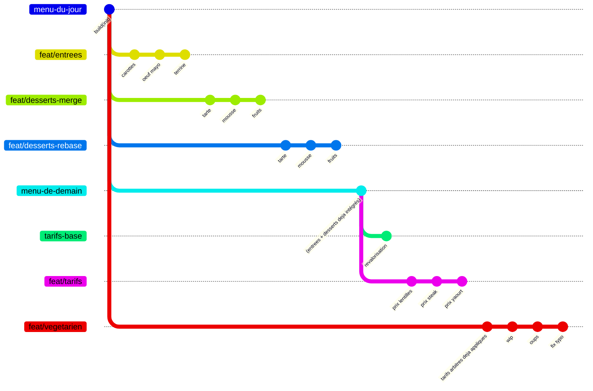
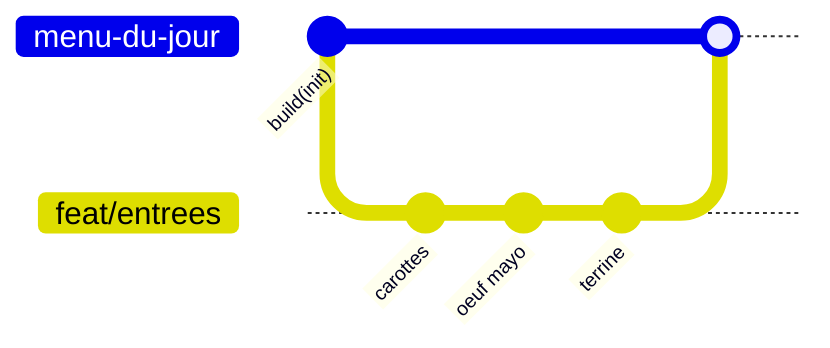
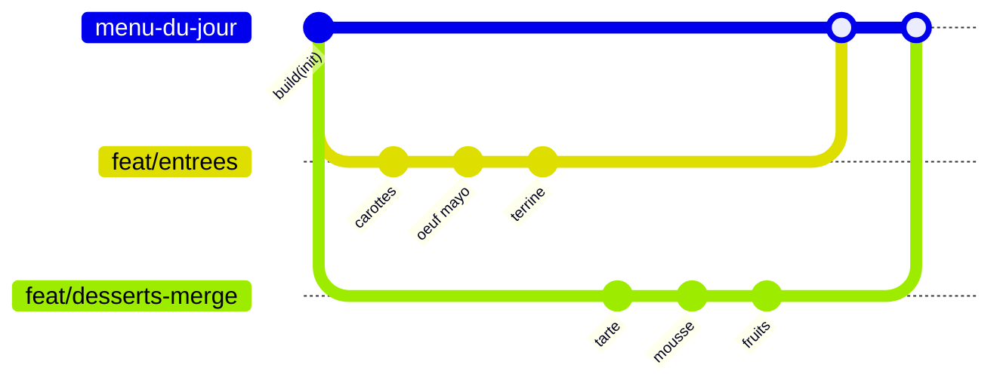
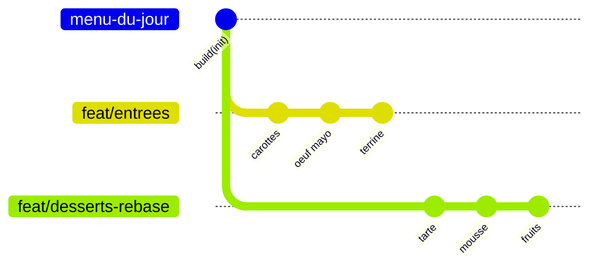
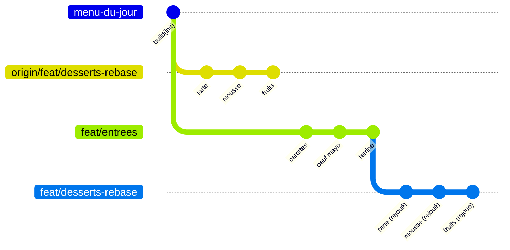
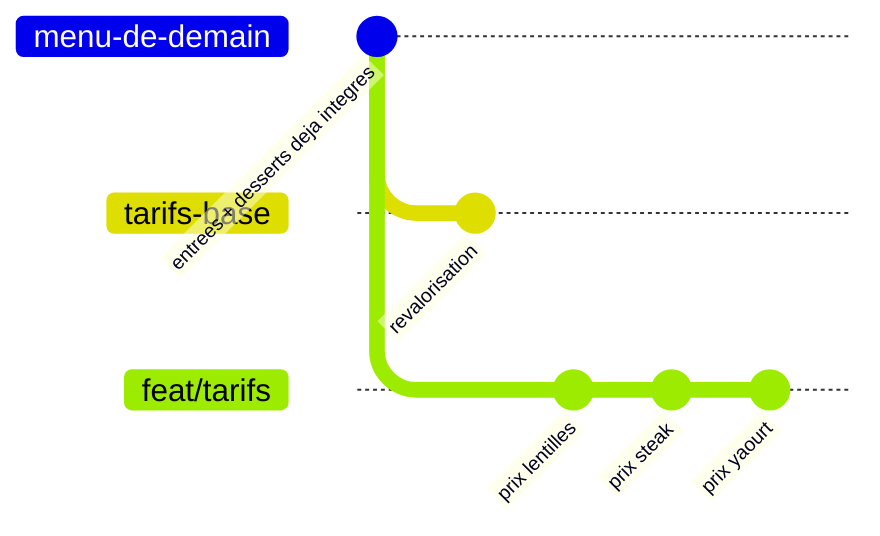
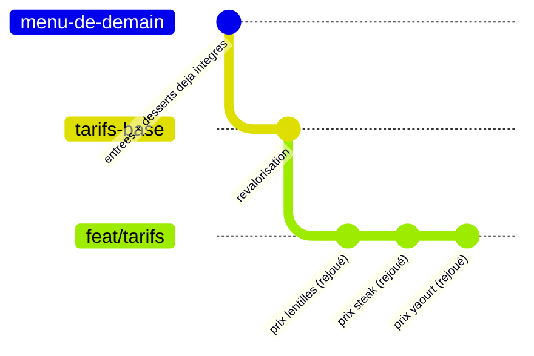
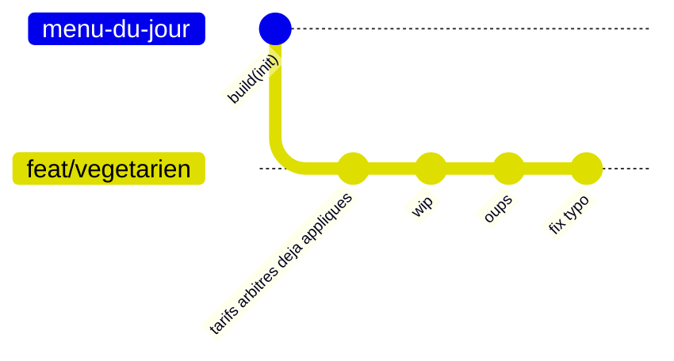
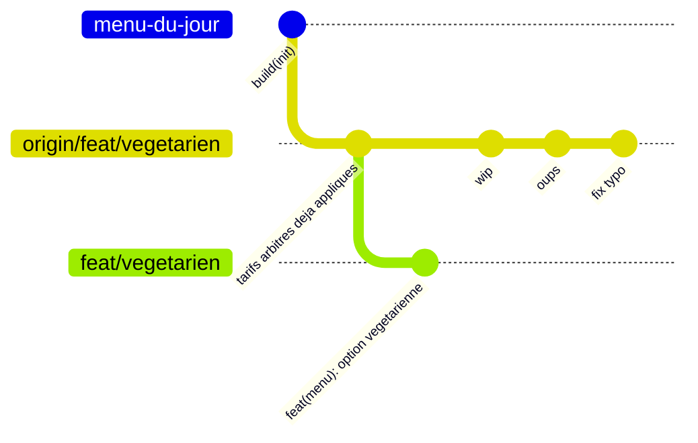

# TP Git • L3 MIAGE 2026-2027 — Le menu du resto U

*Le Crous de Grenoble vous a missionné pour l'aider à préparer les menus de son restaurant universitaire (le "resto U"). Suite à un problème d'organisation, les menus préparés pour aujourd'hui et demain se sont retrouvés éparpillés dans plusieurs commits sur différentes branches.*

## Objectif du TP

Votre rôle consiste à réassembler ces menus grâce à vos connaissances sur Git au travers de six exercices.

> Vous retrouverez les **commandes** utiles dans [docs/commandes.md](docs/commandes.md) ainsi que les **concepts** Git (zones, fast-forward, branches distantes...) dans [docs/concepts.md](docs/concepts.md).

## Pré-requis

Avant de commencer assurez-vous que les outils suivants soient bien installés :
- **Java** — pour lancer la commande de vérification du TP ; testez que la commande `java --version` fonctionne,
- Sur **VSCode** :
  - L'extension [**Markdown Preview Mermaid Support**](https://marketplace.visualstudio.com/items?itemName=bierner.markdown-mermaid) — pour visualiser les graphes Git au format Mermaid ; vérifiez qu'ils s'affichent bien ci-dessous.
  - *(Optionnel)* L'extension [**Git Graph**](https://marketplace.visualstudio.com/items?itemName=mhutchie.git-graph) — pour visualiser directement sous forme d'arbre l'état de votre dépôt (plutôt qu'avec `git log`).

## Installation

1. Créez un nouveau dépôt en cliquant sur le bouton `Fork` en haut à droite. Une fois sur l'interface de création du dépôt, **décochez** `Copy the menu-du-jour branch only`, puis cliquez sur le bouton `Create fork` en bas à droite. Vous devriez maintenant avoir votre propre dépôt à cette adresse : `https://github.com/<votre-compte-github>/l3m-git-2026-2027`.
2. **Clonez** votre dépôt sur votre machine en local avec la commande suivante, puis ouvrez-le avec votre éditeur :

```sh
git clone https://github.com/l3miage-<votre-nom>/l3m-git-2026-2027
```

4. **Configurez** ensuite Git pour expliciter les fusions dans l'arbre des commits afin de pouvoir mieux suivre votre travail :

```sh
git config merge.ff false
```

> Pour en savoir plus à ce sujet, vous pouvez consultez la section **fast-forward** du document [docs/concepts.md](docs/concepts.md).

Vous êtes maintenant prêt·e à démarrer !

---

## Exercice 0 — Prise en main

### Contexte

Voici un graphe présentant l'état actuel du dépôt :



Sur la branche `menu-du-jour`, le dépôt contient un menu de trois plats ainsi qu'une affiche `AFFICHE.md` qui expose le nombre de plats et le prix du menu à des fins de vérification. Toutes les autres branches **ajoutent** ou **modifient** des plats afin de pouvoir reconstruire le menu complet.

### Pour commencer

1. Pour vous aider à garantir la cohérence du menu, le Crous vous met à disposition un *vérificateur*. **Après chaque fusion**, celui-ci vous permettra de comparer le nombre de plats et le prix attendus à celui que vous avez actuellement, et vous indiquera également votre progression au niveau des exercices :

```sh
java Verificateur.java
```

Sans argument, il résume l'état actuel du menu et vous situe dans la progression :

```
Etat des lieux

  menu    : 3 plats, 530 centimes
  affiche : 3 plats, 530 centimes

Cible atteinte : exercice 0.
Pour le detail d'un exercice : java Verificateur.java 0
```

En lui donnant un numéro d'exercice, il détaille chaque contrôle. Voici par exemple ce qu'il répond pour l'exercice 1 tant que celui-ci n'a pas été fait :

```
Verification de l'exercice 1

Aucun conflit en suspens
  OK     aucun marqueur de conflit

Le menu
  ECHEC  nombre de plats                  3 (attendu 6)
  ECHEC  total du menu                    530 (attendu 880)
  OK     total sous le budget             true
  OK     une entree au menu               true

L'affiche du jour correspond au menu
  OK     nombre de plats affiche          3
  OK     total affiche                    530

IL RESTE DU TRAVAIL : 2 controle(s) en echec sur 7.
```

Chaque ligne correspond à un contrôle :

- **`OK`** — le contrôle passe, il n'y a rien à faire.
- **`ECHEC`** — le contrôle échoue : la valeur trouvée dans vos fichiers est affichée d'abord, la valeur attendue juste après entre parenthèses. Ici, `3 (attendu 6)` signifie que le menu ne contient que 3 plats alors qu'il devrait en compter 6 — les entrées n'ont pas encore été intégrées.
- La dernière ligne résume : **`TOUT EST VERT`** quand l'exercice est terminé, **`IL RESTE DU TRAVAIL`** tant qu'au moins un contrôle échoue.

2. Vous pouvez maintenant faire un état des lieux en **consultant l'historique** via la commande suivante (vous pouvez également utiliser [**Git Graph**](#pré-requis)):

```sh
git log --graph --oneline --all
```

Vous observerez que les branches liées aux exercices portent le préfixe `origin/` : `origin/feat/entrees` désigne la branche telle qu'elle existe sur le **dépôt distant** (c'est-à-dire ce qu'il y a sur *GitHub*). C'est sous cette forme que les exercices suivants y feront référence.

---

## Exercice 1 — Trois commits et une fusion

### Objectif

Ajouter les entrées au menu.



### Contexte

La branche `origin/feat/entrees` ajoute trois entrées au menu, un plat par commit. Ces commits sont déjà faits : vous allez les lire, puis les intégrer à `menu-du-jour`.

### À faire

1. Lisez d'abord les trois commits, sans vous déplacer :

```sh
git log origin/feat/entrees --graph
```

> Leurs messages suivent une convention d'écriture, les *Conventional Commits*, de la forme `type(portée): description`. Voir la section **Nommer ses commits** du document [docs/concepts.md](docs/concepts.md).

2. Placez-vous sur `menu-du-jour` et fusionnez la branche `origin/feat/entrees` :

```sh
git switch menu-du-jour
git merge origin/feat/entrees
```

3. Lancez le vérificateur :

```sh
java Verificateur.java 1
```

### À observer

```sh
git log --graph --oneline --all
```

Un **commit de fusion** est apparu au bout de `menu-du-jour`, et le graphe montre une branche qui part et qui revient. C'est la forme que doit avoir toute fusion de ce TP.

---

## Exercice 2 — Une fusion qui entre en conflit

### Objectif

Ajouter les desserts au menu, et découvrir qu'une fusion sans conflit peut quand même être fausse.



### Contexte

La branche `origin/feat/desserts-merge` ajoute trois desserts. Elle est partie du commit initial, en même temps que les entrées : les deux branches ont modifié les mêmes fichiers sans se voir.

### À faire

1. Depuis `menu-du-jour`, fusionnez la branche `origin/feat/desserts-merge` :

```sh
git merge origin/feat/desserts-merge
```

Git s'arrête et signale deux fichiers en conflit. Pour lire les marqueurs de conflit et savoir comment les résoudre, voir [docs/concepts.md](docs/concepts.md).

2. Résolvez les trois points suivants :

- **`CHANGELOG.md` — gardez les deux côtés.** Les trois lignes des entrées s'opposent aux trois lignes des desserts, sous la même rubrique. Les six modifications ont bien eu lieu : la résolution consiste à garder les six lignes.
- **`AFFICHE.md`, ligne du total — aucun des deux côtés n'est la réponse.** Un côté annonce 880, l'autre 890. Ni l'un ni l'autre n'est correct : le menu réunit maintenant les entrées **et** les desserts. Si votre éditeur vous propose « accepter le courant » ou « accepter l'entrant », les deux vous donneront un résultat faux. Calculez la bonne valeur.
- **`AFFICHE.md`, ligne du nombre de plats — Git n'a rien signalé, et la valeur est fausse.** Les deux branches avaient écrit 6 ; comme elles écrivaient la même chose, Git a pris cette valeur sans rien dire. Or le menu compte désormais 9 plats. Corrigez-la vous-même.

3. Une fois les deux fichiers résolus :

```sh
git add AFFICHE.md CHANGELOG.md
git commit
java Verificateur.java 2
```

### À observer

**Une fusion sans conflit ne garantit rien.** Git sait recoller des lignes, il ne sait pas si le résultat a du sens. C'est le vérificateur qui vous le révèle, et c'est pour cela qu'il faut le lancer après chaque fusion.

Remarquez au passage que `Menu.java` s'est fusionné tout seul, et correctement : les entrées se sont insérées en haut du tableau, les desserts en bas.

---

## Exercice 3 — Rejouer des commits plutôt que fusionner

### Objectif

Ajouter les desserts au menu en **rejouant** des commits, plutôt qu'en fusionnant une branche.

**Avant** — les entrées et les desserts partent tous les deux du commit initial, chacun de leur côté :



**Après** — les trois commits de desserts ont été rejoués par-dessus les entrées. Ce sont de nouveaux commits : les trois commits de départ, eux, n'ont pas bougé et restent visibles sur `origin/feat/desserts-rebase` :



### Contexte

La branche `origin/feat/desserts-rebase` ajoute trois desserts, un plat par commit, en partant du tout premier commit du dépôt. Au lieu de la fusionner, vous allez **rejouer** ses trois commits par-dessus les entrées : c'est le rôle de `git rebase`. **Aucune fusion dans cet exercice.**

### À faire

1. Les desserts doivent être rejoués par-dessus les entrées. Affichez donc le dernier commit de `origin/feat/entrees` :

```sh
git log --oneline -1 origin/feat/entrees
```

La ligne affichée commence par l'**id** du commit : une courte suite de lettres et de chiffres, par exemple `4bfb9ac`. Cet id désigne ce commit et lui seul — copiez-le, vous en avez besoin juste après.

2. Placez-vous sur la branche des desserts et rejouez-la sur ce commit :

```sh
git switch feat/desserts-rebase
git rebase <id copié>
```

> Par exemple `git rebase 4bfb9ac`. Utilisez bien l'id que vous venez de copier, il peut être différent de celui de cet exemple.

> Si vous êtes perdu·e à n'importe quel moment :
>
> ```sh
> git rebase --abort
> ```
>
> Vous revenez exactement où vous étiez avant de lancer le rebase, et vous pouvez recommencer.

3. Le rebase ne fusionne pas : il **rejoue** les trois commits un par un par-dessus le commit choisi. Il s'arrêtera **deux fois** :

- **au premier commit rejoué**, sur `CHANGELOG.md` : gardez les trois lignes des entrées et celle de la tarte ;
- **au troisième**, sur `AFFICHE.md` : aucune des deux valeurs proposées pour le total n'est la bonne, calculez-la. Et **le nombre de plats est faux lui aussi, sans que Git l'ait signalé** : corrigez-le également.

Le deuxième commit se rejoue tout seul. À chaque arrêt, après avoir corrigé les fichiers :

```sh
git add .
git rebase --continue
```

4. Une fois le rebase terminé :

```sh
java Verificateur.java 3
```

### À observer

```sh
git log --graph --oneline feat/desserts-rebase origin/feat/desserts-rebase
```

Vos trois desserts sont maintenant posés au-dessus des entrées, en ligne droite : aucun commit de fusion n'est apparu. Les trois commits de départ, eux, sont toujours là sur `origin/feat/desserts-rebase` — le rebase ne les a pas déplacés, il en a rejoué des copies ailleurs.

---

## Exercice 4 — Un conflit à chaque commit rejoué

### Objectif

Ajuster les tarifs du menu en rejouant vos commits par-dessus le travail déjà poussé par une autre équipe.

**Avant** — la revalorisation de l'autre équipe et vos trois ajustements de prix partent de la même base, chacun de leur côté, et touchent les mêmes lignes :



**Après** — vos trois commits ont été rejoués par-dessus la revalorisation, en ligne droite et sans commit de fusion. C'est pendant ce rejeu que vous arbitrez les prix, un conflit à la fois :



### Contexte

À partir d'ici, on quitte `menu-du-jour` : cet exercice se déroule sur sa propre base, déjà complète et indépendante de ce que vous avez fait jusqu'ici. Vous repartez donc du bon pied quoi qu'il arrive.

Une autre équipe a déjà poussé la revalorisation annuelle des tarifs sur `origin/tarifs-base`. Votre branche `feat/tarifs` ajuste les mêmes prix, mais différemment. Vous ne fusionnez pas : vous passez par-dessus leur travail.

### À faire

1. Placez-vous sur `feat/tarifs` et rebasez-la :

```sh
git switch feat/tarifs
git rebase origin/tarifs-base
```

> ```sh
> git rebase --abort
> ```
>
> Toujours disponible. Profitez de cet exercice pour l'essayer au moins une fois : abandonnez volontairement le rebase au premier conflit, vérifiez avec `git log --oneline` que votre branche est intacte, puis relancez le rebase.

**Ne lancez pas le vérificateur avant d'avoir terminé ce rebase.** La branche `feat/tarifs` est volontairement incohérente tant que l'arbitrage n'est pas fait : son affiche annonce déjà le total d'arrivée, que son menu n'atteindra qu'à la fin.

2. Le rebase s'arrête **trois fois, une par commit rejoué**, toujours sur `Menu.java`. À chaque fois, un prix de la revalorisation s'oppose au vôtre. Les prix attendus à l'arrivée sont imposés :

| Plat | Prix attendu | D'où il vient |
|---|---|---|
| Salade de lentilles | 140 | le côté `origin/tarifs-base` |
| Steak haché frites | 390 | le côté de votre branche |
| Yaourt nature | 95 | le côté `origin/tarifs-base` |

Autrement dit : **prendre systématiquement le même côté échoue.** Vous devez lire chaque conflit et composer.

Attention également : un bloc de conflit peut contenir plus d'une ligne. Le steak et le yaourt se suivent dans le tableau, Git les présente donc ensemble, et une seule des deux lignes est réellement en jeu. Recopiez l'autre telle qu'elle doit être.

À chaque arrêt :

```sh
git add Menu.java
git rebase --continue
```

3. Une fois le rebase terminé :

```sh
java Verificateur.java 4
```

### À observer

```sh
git log --graph --oneline origin/tarifs-base feat/tarifs
```

Vos trois commits sont maintenant posés au-dessus de la revalorisation, en ligne droite. Aucun commit de fusion.

---

## Exercice 5 — Réécrire ses commits avant de les montrer

### Objectif

Réunir trois commits maladroits en un seul, correctement nommé, avant de les partager.

**Avant** — le travail est fait, mais éparpillé en trois commits aux messages inutilisables :



**Après** — les trois commits n'en font plus qu'un, correctement nommé et au contenu identique. Côté `origin/feat/vegetarien`, rien n'a bougé : une réécriture ne touche que votre branche locale.



### Contexte

La branche `origin/feat/vegetarien` ajoute une option végétarienne au plat principal. Le travail est correct, mais il a été fait en trois commits aux messages inutilisables : `wip`, `oups`, `fix typo`. Vous allez les réunir en un seul, correctement nommé.

### À faire

1. Vérifiez que Git sait quel éditeur ouvrir :

```sh
git config --get core.editor
```

Si la commande ne renvoie rien, définissez-le maintenant, sans quoi Git ouvrira Vim et vous aurez du mal à en sortir :

```sh
git config --global core.editor "code --wait"
```

2. Placez-vous sur la branche et lancez un rebase interactif :

```sh
git switch feat/vegetarien
git rebase -i HEAD~3
```

Git ouvre la liste des trois commits, chacun précédé de `pick`. Les trois verbes à utiliser (`pick`, `squash`, `reword`) sont détaillés dans [docs/commandes.md](docs/commandes.md).

3. Laissez `pick` sur la première ligne, remplacez `pick` par `squash` sur les deux suivantes, enregistrez et fermez. Git rouvre alors l'éditeur avec les trois anciens messages : effacez-les et écrivez à la place :

```sh
feat(menu): ajoute une option végétarienne au plat principal
```

Enregistrez et fermez.

> ```sh
> git rebase --abort
> ```
>
> Vaut aussi pour le rebase interactif.

4. Puis :

```sh
java Verificateur.java 5
```

### À observer

```sh
git log --graph --oneline feat/vegetarien origin/feat/vegetarien
```

Vos trois commits `wip`, `oups` et `fix typo` ont laissé place à un seul commit, correctement nommé, qui porte exactement le même contenu. Les trois commits de départ restent visibles sur `origin/feat/vegetarien` : la réécriture n'a eu lieu que sur votre branche locale, elle n'a rien changé sur le dépôt distant.

---

## Exercice 6 — Ajouter vos propres plats

### Objectif

Créer votre propre branche pour ajouter de nouveaux plats au menu, la pousser sur votre dépôt distant, puis l'intégrer à `menu-du-jour`.

### Contexte

Jusqu'ici, toutes les branches que vous avez fusionnées ou rebasées étaient déjà préparées pour vous par le Crous. Ce dernier exercice vous fait pratiquer le cycle complet d'une contribution : créer une branche, y enregistrer votre propre travail, la pousser sur GitHub, puis la réintégrer.

### À faire

1. Créez votre branche depuis `menu-du-jour` :

```sh
git switch menu-du-jour
git switch -c feat/mes-plats
```

2. Ajoutez un ou plusieurs nouveaux `Plat` dans `Menu.java` (une soupe, un fromage, un café...), puis enregistrez votre travail :

```sh
git add Menu.java
git commit -m "feat(menu): ajoute mes plats"
```

3. Poussez votre branche sur votre dépôt distant :

```sh
git push -u origin feat/mes-plats
```

4. Revenez sur `menu-du-jour` et intégrez votre branche :

```sh
git switch menu-du-jour
git merge feat/mes-plats
```

5. Vérifiez votre menu :

```sh
java Verificateur.java
```

### À observer

Une fusion sans le moindre conflit, puisque vous êtes seul·e à avoir modifié cette branche — contrairement aux exercices précédents. C'est la situation la plus fréquente en réalité : la plupart des fusions se passent sans encombre, mais il faut être capable de gérer les autres.

---

## Exercices bonus

À faire seulement si vous avez terminé les six exercices. Ils sont indépendants les uns des autres et le vérificateur ne les connaît pas.

Chacun commence par créer une branche jetable : vous ne risquez donc rien, et vous pouvez les recommencer autant de fois que vous voulez.

### Bonus A — Défaire sans casser

Créez une branche jetable depuis `menu-du-jour`, puis faites-y un commit volontairement mauvais : donnez à un plat le prix de 9999 centimes. Lancez le vérificateur et constatez qu'il passe au rouge.

Annulez maintenant ce commit de deux façons, l'une après l'autre :

```sh
git revert <identifiant du commit>
```

ajoute un nouveau commit qui défait le précédent. L'historique grossit, rien n'est perdu.

```sh
git reset --hard <identifiant du commit d'avant>
```

recule le pointeur de la branche. L'historique rétrécit, le commit disparaît de la branche.

Le contenu final est le même dans les deux cas, l'historique non.

**À consigner :** les deux `git log --oneline`, et une phrase sur le cas où l'un vaut mieux que l'autre. Indice : la branche est-elle partagée ?

### Bonus B — Mettre de côté

Modifiez un fichier sans l'enregistrer, puis :

```sh
git stash
```

range vos modifications et rend le répertoire propre, ce qui vous permet de changer de branche. Pour les remettre :

```sh
git stash pop
```

### Bonus C — Deux répertoires de travail

Comment traiter une correction urgente sans toucher à votre travail en cours.

```sh
git worktree add ../menu-hotfix <une branche existante>
git worktree list
git worktree remove ../menu-hotfix
```

Deux points qui surprennent :

- une même branche ne peut pas être active dans deux répertoires de travail à la fois ;
- chaque répertoire de travail a ses propres fichiers non versionnés.

### Bonus D — Retrouver ce qu'on croit perdu

Fait suite au bonus A, si vous avez choisi `git reset --hard` : ce commit a disparu de la branche.

```sh
git reflog
```

liste tout ce que `HEAD` a visité, y compris ce qui n'est plus atteignable depuis aucune branche. Retrouvez-y le commit effacé au bonus A et récupérez-le sur une nouvelle branche.

Retenez ceci : tant qu'un commit a existé, il reste presque toujours récupérable pendant plusieurs semaines. C'est ce qui rend Git sûr.
